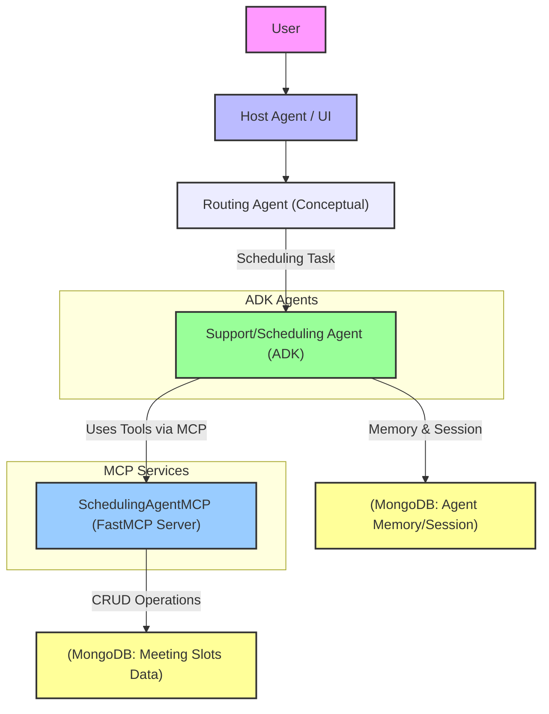
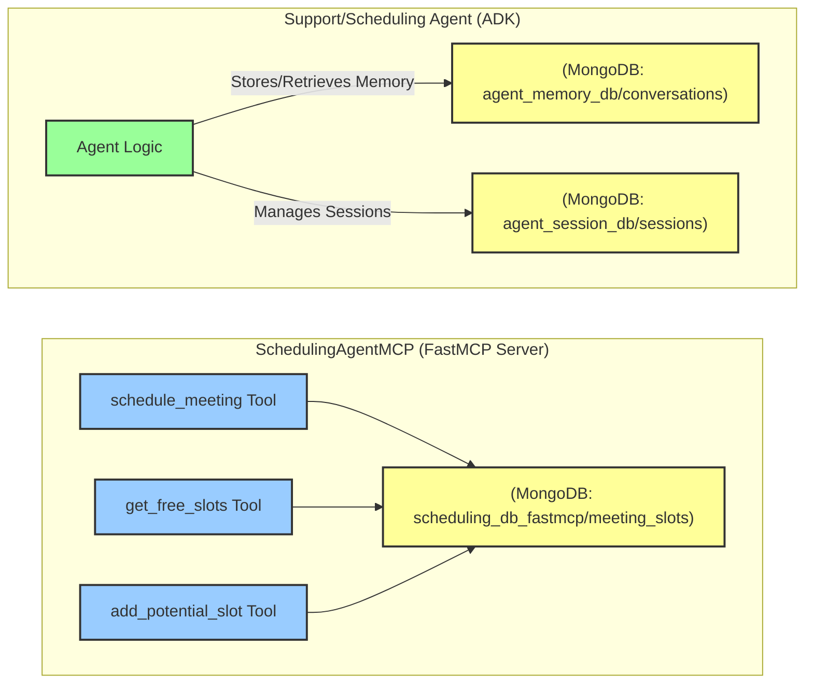
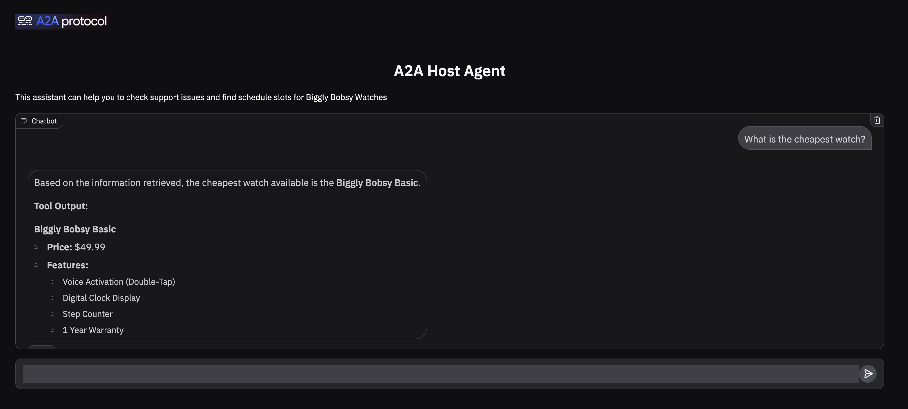

# A2A MCP App - Agent Architecture and MongoDB Integration

> ### This repo is built on top of Google's a2a code example.
> Code origin: https://github.com/google-a2a/a2a-samples/tree/main/samples/a2a-adk-app
>


This project demonstrates an Agent-to-Agent (A2A) communication setup involving a routing agent, a support/scheduling agent, and a dedicated MCP server for managing meeting schedules. MongoDB plays a crucial role in this architecture, serving both as a persistent data store for the scheduling MCP and as a backend for agent memory and session management.

## Agent Interaction Flow



1.  **User Interaction**: A user interacts with a primary interface or a "host" agent.
2.  **Routing Agent (Conceptual)**: The initial request is (conceptually) processed by a routing agent. This agent determines the nature of the request and forwards it to the appropriate specialized agent. For scheduling-related tasks, it routes to the Support/Scheduling Agent.
3.  **Support/Scheduling Agent**:
    *   This agent is built using the Google ADK (`LlmAgent`).
    *   Its primary responsibility is to handle calendar scheduling queries and event creation.
    *   It is instructed to use specific tools for these tasks.
    *   It connects to the `SchedulingAgentMCP` to perform actions like booking meetings or finding free slots.
    *   It utilizes MongoDB for its own conversational memory and session state management (via `mongodb_memory_service.py` and `mongodb_session_service.py` found in agent directories like `support_agent` and `scheduling_agent` within this project).
4.  **SchedulingAgentMCP (FastMCP Server)**:
    *   This is a dedicated MCP server (implemented in `A2A-MCP/Simple/a2a_agents/mcp/main.py` using the `fastmcp` library).
    *   It exposes tools specifically for managing meeting schedules (e.g., `schedule_meeting`, `get_free_slots`).
    *   It uses MongoDB as its backend data store to persist meeting slot information.

## MongoDB Integration Details



MongoDB serves two distinct purposes in this system:

### 1. Data Store for SchedulingAgentMCP

*   **Implementation**: The `fastmcp` server located at `A2A-MCP/Simple/a2a_agents/mcp/main.py` directly interacts with a MongoDB database to manage meeting slots.
*   **Database & Collection**:
    *   Database Name: `scheduling_db_fastmcp` (configurable in `main.py`)
    *   Collection Name: `meeting_slots` (configurable in `main.py`)
*   **Functionality**:
    *   The `schedule_meeting` tool creates new meeting documents or updates existing ones in this collection.
    *   The `get_free_slots` tool queries this collection to find unbooked time slots.
    *   The `add_potential_slot` tool allows for adding new slot documents directly.
*   **Data Model**: Meeting slots are stored with details such as `title`, `description`, `name`, `phone_number`, `start_time`, `end_time`, and a `booked` status.
*   **Connection**: The `fastmcp` server uses the `motor` library for asynchronous MongoDB operations. The connection URI is loaded from the `MONGODB_URI` variable in the `.env` file located at `A2A-MCP/Simple/a2a_agents/mcp/.env`.

### 2. Agent Memory and Session Provider (for ADK Agents)

*   **Implementation**: The ADK-based agents (like the Support/Scheduling Agent defined in files such as `A2A-MCP/Simple/a2a_agents/support_agent/adk_agent.py` or `A2A-MCP/Simple/a2a_agents/scheduling_agent/adk_agent.py`) are designed to use MongoDB for persisting conversational memory and session state.
*   **Services**:
    *   `mongodb_memory_service.py`: Provides an interface for storing and retrieving agent memory (e.g., past interactions, user preferences) in a MongoDB collection, typically named `agent_memory` or similar.
    *   `mongodb_session_service.py`: Manages agent session information, allowing conversations to be stateful across multiple turns. This also uses MongoDB for persistence.
*   **Connection**: These services also rely on the `MONGODB_URI` environment variable, typically loaded from an `.env` file within their respective agent directories (e.g., `A2A-MCP/Simple/a2a_agents/support_agent/.env`). The database and collection names for memory and sessions might differ from the scheduling MCP's data store but often use the same MongoDB instance.
*   **Purpose**: This allows the agents to maintain context over extended interactions, remember previous parts of the conversation, and provide more coherent and personalized responses.

## Configuration

*   The MongoDB connection string (`MONGODB_URI`) is a critical piece of configuration. It must be set correctly in the relevant `.env` files for both the `SchedulingAgentMCP` and any ADK agents that use MongoDB for memory/session management.
    *   For `SchedulingAgentMCP`: `A2A-MCP/Simple/a2a_agents/mcp/.env`
    *   For ADK Agents (e.g., Support Agent): `A2A-MCP/Simple/a2a_agents/support_agent/.env` (and similarly for other agents).
*   The `MEETING_SECHDULE_MCP` environment variable (seen in the provided agent definition snippet) should point to the URL where the `SchedulingAgentMCP` is running (e.g., `http://localhost:8001/sse` if running locally with SSE transport on port 8001).

## Quick Start

### Install prerequisites

```
cd a2a_agants
uv run pip install -r requirements.txt
```

### Setup MongoDB Atlas URI and GOOGLE_API_KEY

Copy `.env.example` to `.env` in the following folders and fill them with your env variables:
- host_agent
- support_agent
- scheduling_agent


### Run MCP server for meeting schedules control 

```
# seperate terminal
cd mcp 
uv run main.py
```

### Run Scheduling agent

```
# seperate terminal
cd scheduling_agent
uv run .
```

### Run support agent
```
# seperate terminal
cd support_agent
uv run .
```

### Run host agent and app

```
# seperate terminal
cd host_agent
uv run app.py
```

When the app.py is up you can access it via http://0.0.0.0:8083/ 



This dual use of MongoDB – as a transactional data store for the scheduling tools and as a flexible memory backend for the conversational agents – allows for a robust and stateful A2A system.
