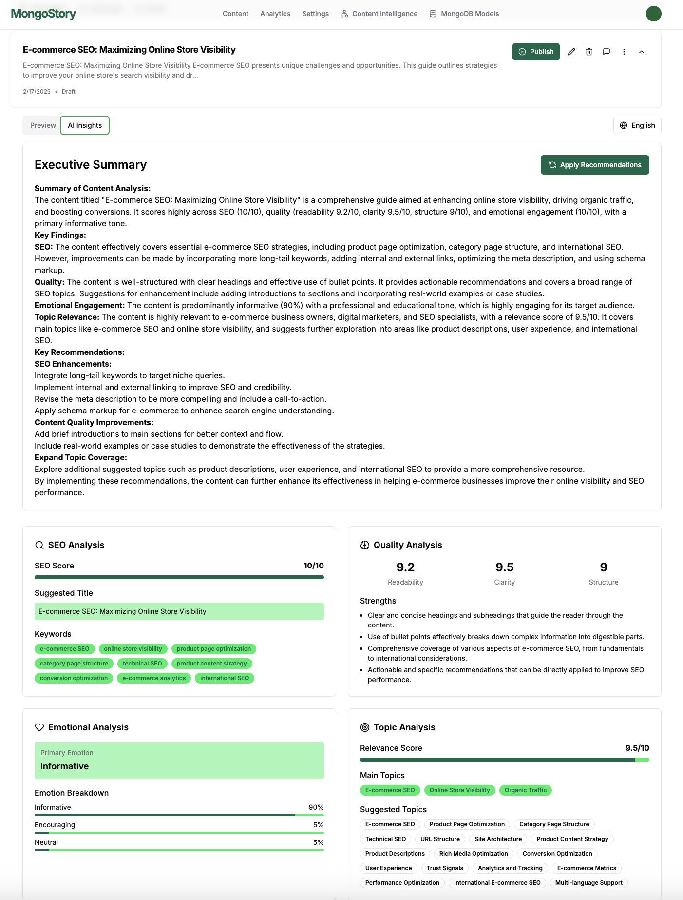

# MongoStory Project Overview

## Introduction

MongoStory is a cloud-native platform designed to empower content creators, editors, and publishers with AI-driven tools for content management and distribution. Built with Next.js 15 and MongoDB, the platform offers a comprehensive suite of features for content creation, analysis, translation, and optimization.



## Core Features

### Content Management
- **Content Creation & Editing**: Rich markdown editor for creating and editing content
- **Content Versioning**: Track revisions and compare different versions of content
- **Publishing Workflow**: Draft, review, and publish content with status tracking
- **Content Organization**: Semantic clustering and intelligent categorization

### AI-Powered Features
- **Content Analysis**: Analyze content quality, readability, and structure
- **SEO Optimization**: AI-generated recommendations for improving search visibility
- **Emotional Impact Analysis**: Understand the emotional tone and impact of content
- **Topic Analysis**: Identify main topics and suggest related content areas
- **Automatic Translation**: Translate content to multiple languages with AI
- **Social Media Post Generation**: Create platform-specific social media posts from content

### Analytics & Intelligence
- **Performance Metrics**: Track views, engagement, and user behavior
- **Content Intelligence**: AI-driven insights about content relationships and gaps
- **Semantic Search**: Find content based on meaning rather than just keywords
- **Topic Distribution**: Visualize content distribution across topics
- **Content Clusters**: Automatically group related content by semantic similarity

## Technical Architecture

### Frontend
- **Framework**: Next.js 15 with App Router
- **UI Components**: Custom components built with shadcn/ui
- **State Management**: React Context API for global state
- **Authentication**: JWT-based authentication system

### Backend
- **API Routes**: Next.js API routes for server-side functionality
- **Database**: MongoDB for flexible document storage
- **Vector Search**: MongoDB Atlas Vector Search for semantic content operations
- **AI Integration**: Integration with AI models via AI SDK - xAI (Grok)

### AI Integration
- **Content Generation**: AI-powered content creation and suggestions
- **Analysis**: Multi-faceted content analysis (SEO, quality, emotion, topics)
- **Vector Embeddings**: Content embeddings for semantic search and clustering - VoyageAI embeddings
- **Translation**: Multilingual content support with AI translation

## MongoDB Integration

MongoStory leverages MongoDB's document model for flexible content storage and its vector search capabilities for advanced content operations:

- **Collections Structure**:
  - `content`: Stores all content items with embedded analysis and translations
  - `users`: User accounts and authentication information
  - `analytics`: Content performance metrics
  - `clusters`: AI-generated content clusters
  - `socialMediaPosts`: Generated social media content

- **Vector Search**: Uses MongoDB Atlas Vector Search for semantic operations:
  - Content similarity detection
  - Semantic search functionality
  - Automatic content clustering

## Getting Started

### Prerequisites
- Node.js 18+ and npm/yarn
- MongoDB Atlas account
- AI API keys:
- - Grok AI API key
- - Voyage AI API Key.

### Installation
1. Clone the repository
2. Install dependencies with
```
npm install
## npm install --force
```
3. Configure environment variables
4. Run the development server with `npm run dev`

### Environment Variables
- `MONGODB_URI`: Connection string for MongoDB Atlas
- `JWT_SECRET`: Secret for JWT authentication
```
openssl rand -base64 32
```
- `XAI_API_KEY`: API key for AI services
- `VOYAGE_API_KEY`: API key for vector embeddings
- `NEXT_PUBLIC_APP_URL`: The main domain of the app (eg. http://localhost:3000).

### Trigger for content embedding:

Set a `VOYAGE_API_KEY` - Value + Secret on the triggers app.

Create the following Atlas Trigger to be placed on insert for `mongostory.content` collection:

```js
exports = async function(changeEvent) {
  // Get the full document that triggered the event
  const fullDocument = changeEvent.fullDocument;

  // Extract the text field that needs to be embedded
  // Change 'text' to whatever field contains the content you want to embed
  const textToEmbed = fullDocument.analysis.summary;

  if (!textToEmbed) {
    console.log("No text field found in the document");
    return;
  }

  try {
    // Connect to your MongoDB cluster
    const collection = context.services.get("ILCluster").db("mongostory").collection("content");

    // Call Voyage AI API to generate embeddings
    const response = await context.http.post({
      url: "https://api.voyageai.com/v1/embeddings",
      headers: {
        "Authorization": [`Bearer ${context.values.get("VOYAGE_API_KEY")}`],
        "Content-Type": ["application/json"]
      },
      body: JSON.stringify({
        "input": [textToEmbed],
        "model": "voyage-3",
        // Optional parameters based on your needs
        "input_type": "document", // Use "query" for search queries, "document" for content
      })
    });

    // Parse the response
    const responseData = EJSON.parse(response.body.text());

    // Get the embedding from the response
    const embedding = responseData.data[0].embedding;

    // Update the document with the embedding
    await collection.updateOne(
      { _id: fullDocument._id},
      { $set: { embedding: embedding } }
    );

    console.log(`Successfully added embedding to document ${fullDocument._id}`);

    // Optional: Create a vector search index if it doesn't exist
    // Note: This should ideally be done once, not in every trigger execution
    // This is just for demonstration purposes

    return { status: "success" };

  } catch (error) {
    console.error("Error in Voyage AI embedding trigger:", error);
    return { status: "error", message: error.message };
  }
};
```


### Vector Search on content data

Create a vector search index (named `vector_index`)  on `content` collection:
```
{
  "fields": [
    {
      "type": "vector",
      "path": "embedding",
      "numDimensions": 1024,
      "similarity": "cosine"
    }
  ]
}
```


## Key Components

### Dashboard
The central hub providing access to all platform features with overview metrics and quick actions.

### Content Management
Interface for creating, editing, and managing content with AI assistance.

### Analytics
Detailed metrics on content performance, user engagement, and distribution channels.

### Content Intelligence
AI-powered insights into content relationships, gaps, and optimization opportunities.

### MongoDB Schema Viewer
Visual representation of the database structure and relationships.

## Future Development

- **Workflow Automation**: Advanced publishing workflows with approval processes
- **Personalization Engine**: Content personalization based on user behavior
- **Advanced Analytics**: Predictive analytics for content performance
- **Multi-channel Distribution**: Expanded distribution options beyond social media
- **Collaboration Tools**: Enhanced team collaboration features

## Contributing

Contributions to MongoStory are welcome! Please refer to the CONTRIBUTING.md file for guidelines.

## License

This project is licensed under the MIT License - see the LICENSE file for details.
